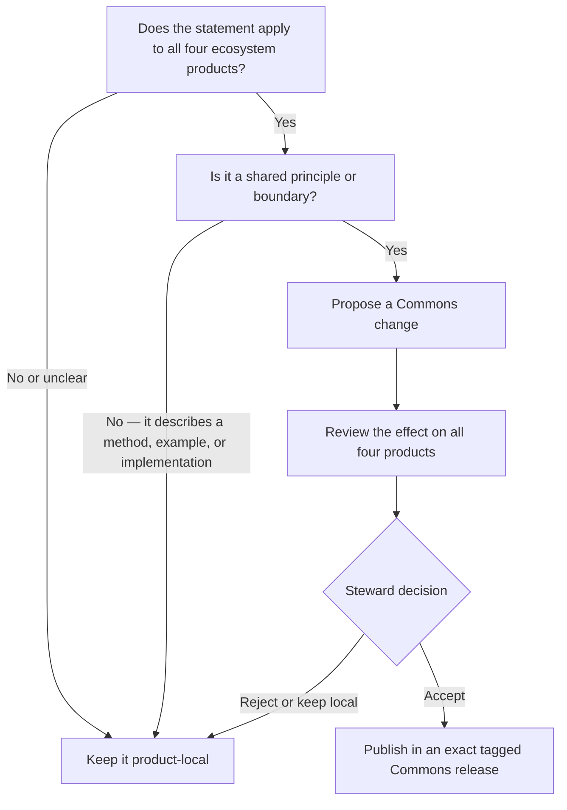

# Shared Boundaries

## Commons is shared documentation

Commons contains principles and boundaries that apply across the ecosystem. It does not prescribe software, automation, schemas, APIs, databases, agents, dashboards, workflows, or technical architecture.

## Every product stands alone

AI-Native Operating Framework, Influence Operating Framework, AI Dev Days, and Relationship Operating Framework each own their:

- purpose and audience;
- practical guidance and methods;
- examples and research;
- terminology beyond the shared vocabulary;
- Mission Control recommendations;
- license, governance, and release decisions; and
- implementation choices, if any.

Referencing Commons does not make a product a module, child product, or implementation of Commons.

## Shared versus local test

A statement belongs in Commons only when it expresses a principle or boundary that should apply to all four ecosystem products.

If a statement tells someone how to perform AI-native work, practice influence, run AI Dev Days, or steward a relationship, it belongs in that product instead.

When uncertain, keep the idea local until repeated use shows that it is genuinely shared.

### Where guidance belongs

This diagram answers whether a statement belongs in Commons or should remain with one product.

Publication does not change another product. Each product's separate adoption decision is shown in [Governance](GOVERNANCE.md#adoption-flow).

## Mission Control

Mission Control is a product-local documentation and design concern. A product may describe the information, decisions, health, research, contributions, actions, and approvals that a useful implementation should make visible.

Commons requires no Mission Control application, shared interface, data model, design system, or implementation. Product guidance should remain stack-agnostic so adopters can use the tools that fit them.

## Community extensions

Extensions may help people apply a product, but they do not redefine Commons or the product's core guidance. Extension registries, verification labels, voting rules, and technical manifests remain future product or ecosystem decisions until real community demand exists.

## AI Dev Days

AI Dev Days is an independent learning community, not a framework module. It may teach, explore, and contribute learning about ecosystem products while retaining its own charter, program, and decisions.
