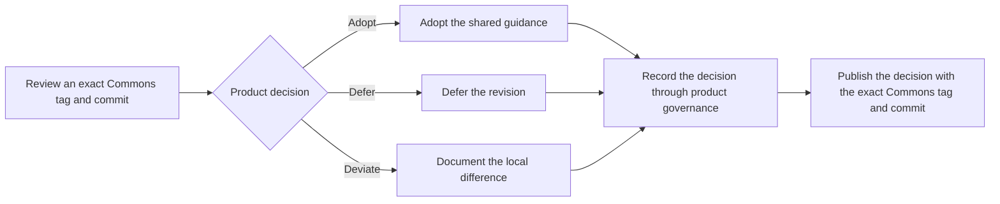

# Governance

## Stewardship

Brad Groux is the founding steward of Open Framework Commons.

The steward decides changes to the shared documentation. Contributors and agents may research, draft, review, and recommend changes, but they do not acquire authority to change Commons or another product implicitly.

## Change test

Before changing Commons, answer:

1. Does this principle or boundary apply to AI-Native Operating Framework, Influence Operating Framework, AI Dev Days, Relationship Operating Framework, and Focus Operating Framework?
2. Would keeping it local create real confusion across the ecosystem?
3. Can it remain documentation without prescribing a system or implementation?
4. Does it preserve each product's independent purpose and authority?

If the answer is unclear, keep the idea product-local and revisit it after practical use.

## Review

A meaningful change should be checked for:

- consistency with the charter and principles;
- accidental product hierarchy;
- accidental software or implementation requirements;
- effects on all five products;
- evidence and uncertainty; and
- wording that people and agents can apply without hidden context.

For material changes, preserve a [reasoned evidence and applicability disposition](RESEARCH-AND-REVIEW.md#material-change-disposition) in the issue or decision record. Approval names the authority and rationale, including counterevidence and limits; general assertions of shared applicability are insufficient.

## Resolving conflicts

Pause the disputed action or representation, not unrelated safe work. Identify the exact Commons tag and commit the product adopted and the two statements in tension. A difference on `main` or in a newer, unadopted edition does not change the adopted guidance.

Use the existing product issue or decision process for its local guidance. Use a Commons issue when interpretation or amendment of shared guidance is needed; link the records when both are involved. Keep sensitive evidence private and publish only a safe summary. Product authority decides product methods and deviations; the Commons steward decides Commons meaning and changes. Neither silently overrules the other.

Record the affected action, responsible authority, relevant evidence and uncertainty, material dissent, and a reasoned outcome: correct a misunderstanding, narrow or stop an action, document a local deviation, defer, or propose a separate Commons change. An unresolved case has an owner and a concrete revisit trigger. Silence, elapsed time, or lack of objection does not authorize the disputed action. Work resumes only within the recorded decision’s scope and existing local authority.

See [worked review cases](project/reviews/content-process-cases-2026-09-05.md) for examples. These are illustrations of Commons governance, not required product workflows.

## Adoption

Changing Commons does not automatically change an ecosystem product. Each product records its own decision to adopt, defer, or deviate from a Commons revision.

Make the reviewed repository, tag and exact peeled commit, affected guidance, accountable authority, rationale, and any deferred items or local deviations discoverable through product governance. No particular file format is required. Say “adopts this edition with the following deviations” when exceptions exist; do not imply complete agreement, certification, or loss of ecosystem membership. Retaining an older edition is legitimate. A product’s version number need not match its adopted Commons version.

### Adoption flow

This diagram answers how a product handles an exact Commons release without surrendering its authority.

## Releases

New Commons editions use calendar versions `YYYY.MM.DD` and immutable annotated tags `vYYYY.MM.DD`, based on the UTC publication date. A second publication on the same date uses `.1`, then `.2`; never replace the earlier tag. The first dated edition follows v1.1.0. The date identifies an edition, not its compatibility or effectiveness.

Keep v1.0.0, v1.1.0 and their release pages, changelog entries and adoption references unchanged. Do not add dated aliases to historical editions. Historical verification accepts their original version format; new editions use calendar versions. Changes to `main` do not alter an adopted revision.

### Content compatibility

Assess changed reader decisions, permissions, responsibilities, scope and authority, not the size of the text diff. Release notes identify the prior edition, changes in meaning, local adoption consequences, limitations and required reconsideration.

| Change | Review consequence |
| --- | --- |
| Correct spelling or repair a link without changing meaning | Editorial; explain briefly. |
| Add an optional explanation preserving existing choices | Compatible addition, with the reason it preserves choices. |
| Add an independent scoped product without transferring authority | Scope addition; review all-product applicability. Decision 0001 treated v1.1.0 this way; do not relabel that historical release. |
| Change what a reader may or must do, including narrowing an ambiguous permission | Substantive and potentially incompatible; name affected decisions and what an adopter should reconsider. |
| Change shared authority or require a previously optional behavior | Potentially incompatible; explicit steward decision and independent product adoption are necessary. |

A clarification can change an actual decision despite a small wording diff. Do not call it editorial merely because it matches intended meaning. Use the [evidence disposition](RESEARCH-AND-REVIEW.md#material-change-disposition) and [worked cases](project/reviews/content-process-cases-2026-09-05.md); keep product-specific migration methods local. See the [release procedure](project/RELEASING.md) for publication operations.

## Ecosystem scope changes

Adding, removing, or renaming a product in the Commons scope is an explicit Charter amendment. The steward records the decision and updates all scoped-product references, including the Charter's complete product list and the shared-applicability test. A scope amendment does not change the affected product without that product's separate decision.

## Governance growth

Do not create committees, quorum rules, certification levels, or elaborate contribution machinery before real participation requires them. Governance should grow in response to actual use, not imagined scale.
