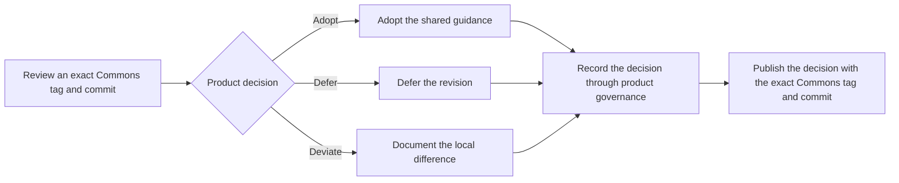

# Governance

## Stewardship

Brad Groux is the founding steward of Open Framework Commons.

The steward decides changes to the shared documentation. Contributors and agents may research, draft, review, and recommend changes, but they do not acquire authority to change Commons or another product implicitly.

## Change test

Before changing Commons, answer:

1. Does this principle or boundary apply to AI-Native Operating Framework, Influence Operating Framework, AI Dev Days, Relationship Operating Framework, and Focus Operating Framework?
2. Would keeping it local create real confusion across the ecosystem?
3. Can it remain documentation without prescribing a system or implementation?
4. Does it preserve each product's independent purpose and authority?

If the answer is unclear, keep the idea product-local and revisit it after practical use.

## Review

A meaningful change should be checked for:

- consistency with the charter and principles;
- accidental product hierarchy;
- accidental software or implementation requirements;
- effects on all five products;
- evidence and uncertainty; and
- wording that people and agents can apply without hidden context.

## Adoption

Changing Commons does not automatically change an ecosystem product. Each product records its own decision to adopt, defer, or deviate from a Commons revision.

### Adoption flow

This diagram answers how a product handles an exact Commons release without surrendering its authority.

## Releases

Published Commons revisions use semantic versioning and immutable annotated Git tags. Each product references the exact tag it reviewed. Changes to `main` do not alter an adopted revision.

## Ecosystem scope changes

Adding, removing, or renaming a product in the Commons scope is an explicit Charter amendment. The steward records the decision and updates all scoped-product references, including the Charter's complete product list and the shared-applicability test. A scope amendment does not change the affected product without that product's separate decision.

## Governance growth

Do not create committees, quorum rules, certification levels, or elaborate contribution machinery before real participation requires them. Governance should grow in response to actual use, not imagined scale.
