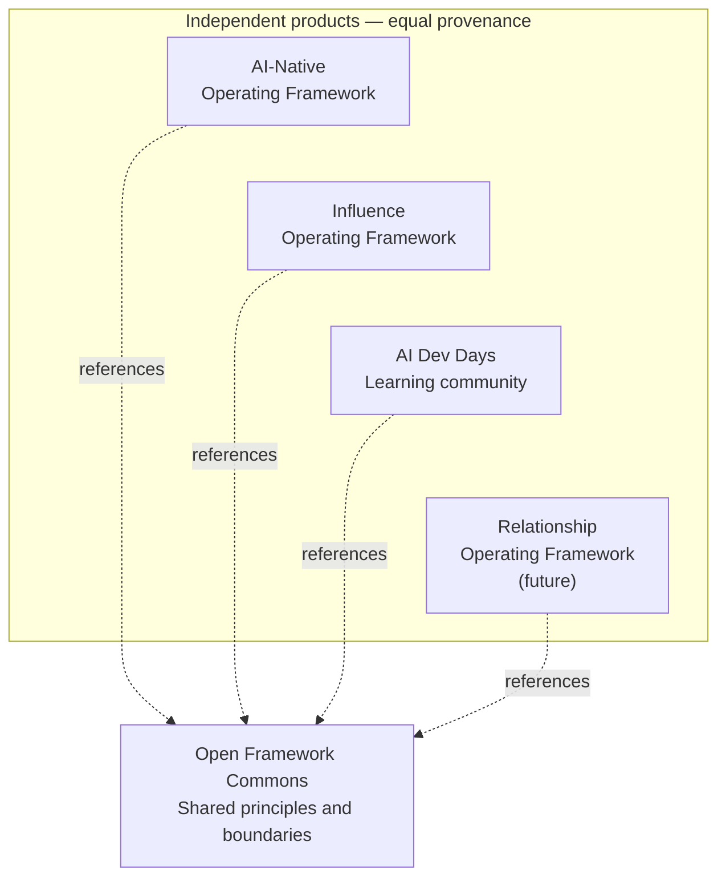

# Open Framework Commons

Open Framework Commons is the small set of shared principles and boundaries for Brad Groux's Open Framework Ecosystem.

This release is scoped to exactly four independent products:

- AI-Native Operating Framework
- Influence Operating Framework
- AI Dev Days
- Relationship Operating Framework, when it is created

Commons is documentation. People and agents can read it before using or changing an ecosystem product so they understand the philosophy those products share.

Commons is not a framework for accomplishing product-specific work. It is not an operating system, application, runtime, compatibility layer, certification, shared data model, or parent product.

## Ecosystem at a glance

This diagram answers how four independent products can share Commons without becoming modules of it.

Commons supplies the shared documentation beneath the products. It does not direct them, rank them, or make adoption automatic.

## Read this first

1. [Charter](CHARTER.md) — purpose and authority
2. [Principles](PRINCIPLES.md) — ideas every product shares
3. [Boundaries](BOUNDARIES.md) — what stays shared and what stays local
4. [Research and review](RESEARCH-AND-REVIEW.md) — how claims and learning remain honest
5. [Governance](GOVERNANCE.md) — how shared documentation changes
6. [Context](CONTEXT.md) — the vocabulary used here

## How people and agents should use Commons

Read Commons for the shared philosophy, then read the selected product for the actual method, examples, and task guidance. If the two appear to conflict, stop and surface the conflict rather than silently rewriting either one.

Each product stands alone. A person may use one product without adopting the others.

## Independent review record

Sanitized independent reviews and their disposition are published in [project/reviews](project/reviews/README.md). Each report identifies the exact commit reviewed and its limitations. Document review does not establish adoption or real-world effectiveness.

## Status

Version 1.0.0 is the approved initial release. No ecosystem product has adopted this release yet.
